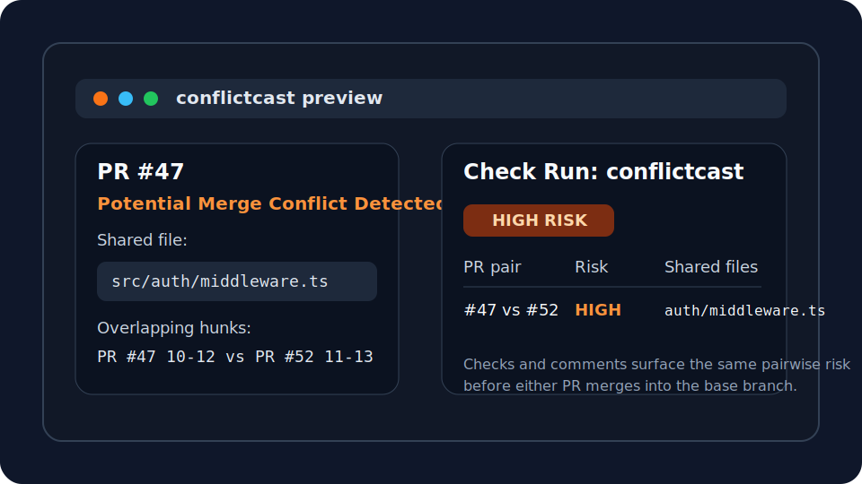

# conflictcast

[](https://github.com/Meru143/conflictcast/actions/workflows/ci.yml)


[](./LICENSE)
[](https://github.com/Meru143/conflictcast/stargazers)

Predict merge conflicts between open pull requests before they land.

`conflictcast` is an open-source GitHub App built with Probot that compares open pull requests, spots overlapping files or hunks, and posts risk signals as GitHub checks and PR comments. The goal is simple: give teams an earlier warning than "this branch no longer merges."



## Why conflictcast

- Catch risky PR pairs before merge queues stall or release branches get blocked.
- Surface conflict risk directly inside GitHub with checks and optional comments.
- Escalate from broad shared-file overlap to precise overlapping-line analysis.
- Ship a lightweight self-hosted stack built on Probot, SQLite, and Docker.

## Feature Highlights

- Pairwise overlap analysis across every open PR in a repository.
- Configurable file-level or line-level conflict detection thresholds.
- Optional LOW-risk comments and fail-on-HIGH-risk check conclusions.
- Per-repo `.conflictcast.yml` configuration for ignore globs and thresholds.
- SQLite-backed persistence for comments, checks, and deduped analysis state.

## How It Works

1. `conflictcast` listens to `pull_request` webhook events through Probot.
2. It fetches open PRs, computes shared-file overlap, and escalates to hunk analysis when configured.
3. It publishes results as check runs and PR comments so engineers can respond before merge time.

## Quick Start

### 1. Create a GitHub App

This repository ships the manifest for creating your own GitHub App. There is not currently a shared hosted install link.

1. Create a new GitHub App from [`app.yml`](./app.yml), or mirror the permissions listed below.
2. Point the app's webhook URL at your deployed `conflictcast` service.
3. Generate a private key and copy the app credentials into your deployment environment.

### 2. Run the service with Docker

```bash
docker build -t conflictcast .
docker run -p 3000:3000 \
  -e APP_ID=... \
  -e PRIVATE_KEY="$(cat private-key.pem)" \
  -e WEBHOOK_SECRET=... \
  -e DATABASE_PATH=./conflictcast.db \
  conflictcast
```

### 3. Configure repository behavior

Place `.conflictcast.yml` in the repository root:

```yaml
ignoreFiles:
  - "package-lock.json"
  - "yarn.lock"
  - "pnpm-lock.yaml"
  - "**/*.md"
  - "**/*.lock"
threshold: "line"
commentOnLow: false
failCheck: false
maxOpenPRsToAnalyze: 50
```

### 4. Run locally for development

```bash
npm ci
cp .env.example .env
npm run build
docker compose up --build
```

## Configuration

| Key | Type | Default | Description |
| --- | --- | --- | --- |
| `ignoreFiles` | `string[]` | `["package-lock.json", "yarn.lock", "pnpm-lock.yaml"]` | Glob patterns ignored before overlap analysis. |
| `threshold` | `"file" \| "line"` | `"line"` | `file` reports any shared file, `line` requires hunk overlap for HIGH risk. |
| `commentOnLow` | `boolean` | `false` | When `true`, LOW-risk pairs receive PR comments in addition to checks. |
| `failCheck` | `boolean` | `false` | When `true`, HIGH-risk check runs conclude with `failure` instead of `neutral`. |
| `maxOpenPRsToAnalyze` | `number` | `50` | Performance guard that skips analysis when the repo has too many open PRs. |

## GitHub App Permissions

| Permission | Access | Why |
| --- | --- | --- |
| `checks` | `write` | Publishes the `conflictcast` check run on PR head commits. |
| `contents` | `read` | Loads `.conflictcast.yml` from the repository root. |
| `issues` | `write` | Creates, updates, and deletes PR comments through the Issues API. |
| `pull_requests` | `read` | Lists open PRs, changed files, and raw diffs. |

## Good Fits

- Monorepos where multiple teams touch shared packages at once.
- Release trains where rebases are expensive and late conflicts hurt delivery.
- Infrastructure or backend repos where line-level overlap is a reliable risk signal.

## FAQ

### Does conflictcast merge or rebase anything?

No. It only reads PR metadata and diffs, then writes check runs or comments.

### What counts as HIGH risk?

HIGH risk means two PRs modify overlapping line ranges in at least one shared file.

### What happens when the repo is too busy?

If open PR count exceeds `maxOpenPRsToAnalyze`, `conflictcast` skips the run and posts an informational `CF005` comment on the triggering PR.

### Can I run conflictcast without Docker?

Yes. The app is a standard Node.js service; Docker is only the recommended deployment path.

## Contributing

See [CONTRIBUTING.md](./CONTRIBUTING.md) for local setup, development commands, and pull request expectations.

If `conflictcast` saves your team from painful rebases, star the repo so other teams can find it.
